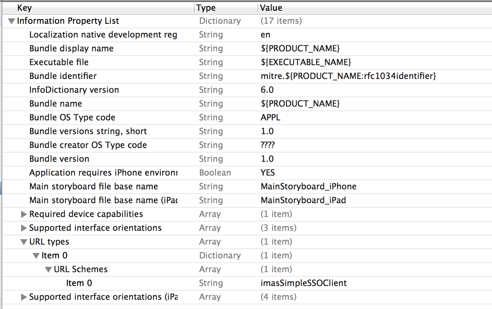

# Single Sign On System

This iMAS control provides an application level Single Sign On system. This can be used to either enhance the security of an existing application, or as a means of providing a first-line of protection.  

The included sso-app has jailbreak and debug detection built-in, using the [iMAS security-check project](https://github.com/project-imas/security-check).  This can slow down attackers by clearing the sensitive SSO data, and preventing logins to any single sign on application when weak device security is detected.  The sso-app can also be coupled with the Apple MDM protocol, to remotely disallow access to all sso-enabled applications. See the [iMAS mdm-server project](https://github.com/project-imas/mdm-server) for details on using Mobile Device Management.  Additionally it monitors system events (Just lock/unlock notifications at the moment), and logs out of the SSO session when appropriate.

# Project Setup

Add the sso-client-api.xcodeproj in the project navigator:  
  * Click on the top level Project item and add files ("option-command-a")
  * Navigate to single-sign-on/client-api
  * Highlight the sso-client-api directory
  * Click the **Add** button

Next we need to set a custom URL scheme for the application.  This can be accomplished by doing the following steps:
  * Expand the "Supporting Files" section in the project navigator.
  * Click on the plist file for your project (Usually the top entry)
  * Two-finger/right click an empty area of the resulting table
  * Select **Add Row**
  * Name the new row "URL types"
  * Expand "URL types" then "Item 0", you should see "URL Identifier"
  * Double click the text "URL Identifier" to start renaming it
  * Change it to "URL Schemes"
  * Expand "URL Schemes" and notice it has "Item 0" under it
  * Double click in the empty "Value" area of "Item 0" to start typing
  * Type in a unique name for your program, and make sure to remember what it is
Below is an example plist table:

Finally make sure the target device has the SingleSignOn application installed, which is located under the sso-app directory.

# Using SSO Client API

In any file that is either grabbing the hash or prompting for a password include the "ssoClient.h" file:
    #import "ssoClient.h"

The API provides "fetch" functions that will get a hashed password value from the sso-app.  If the app has not been logged in before a password box will appear, prompting the user to input the correct response.  Both require, as a parameter the **callbackURI** which is the unique name you provided to the "URL Schemes" in the plist.

Example fetchHash usage:
    
    NSString* ssoHash = [ssoClient fetchHash:@"yourUniqueAppName"];
    
The "fetchAndMergeHash" function provides the same functionality as "fetchHash" but also takes in an "additionalHash" which is XORed with the SSO data.  This is for the case when you want to use SSO in combination with existing security measures. An example usage looks like:
    
    NSString* yourExistingHash = @"foobar";
    NSString* ssoHash = [ssoClient fetchAndMergeHash:@"yourUniqueAppName":yourExistingHash];
    
Finally the "logout" function provides a way for an application to log completely out of the SSO system. It's usage is the following:
    
    [ssoClient logout];

## License

Copyright 2012 The MITRE Corporation, All Rights Reserved.

Licensed under the Apache License, Version 2.0 (the "License");
you may not use this work except in compliance with the License.
You may obtain a copy of the License at

    http://www.apache.org/licenses/LICENSE-2.0

Unless required by applicable law or agreed to in writing, software
distributed under the License is distributed on an "AS IS" BASIS,
WITHOUT WARRANTIES OR CONDITIONS OF ANY KIND, either express or implied.
See the License for the specific language governing permissions and
limitations under the License.

